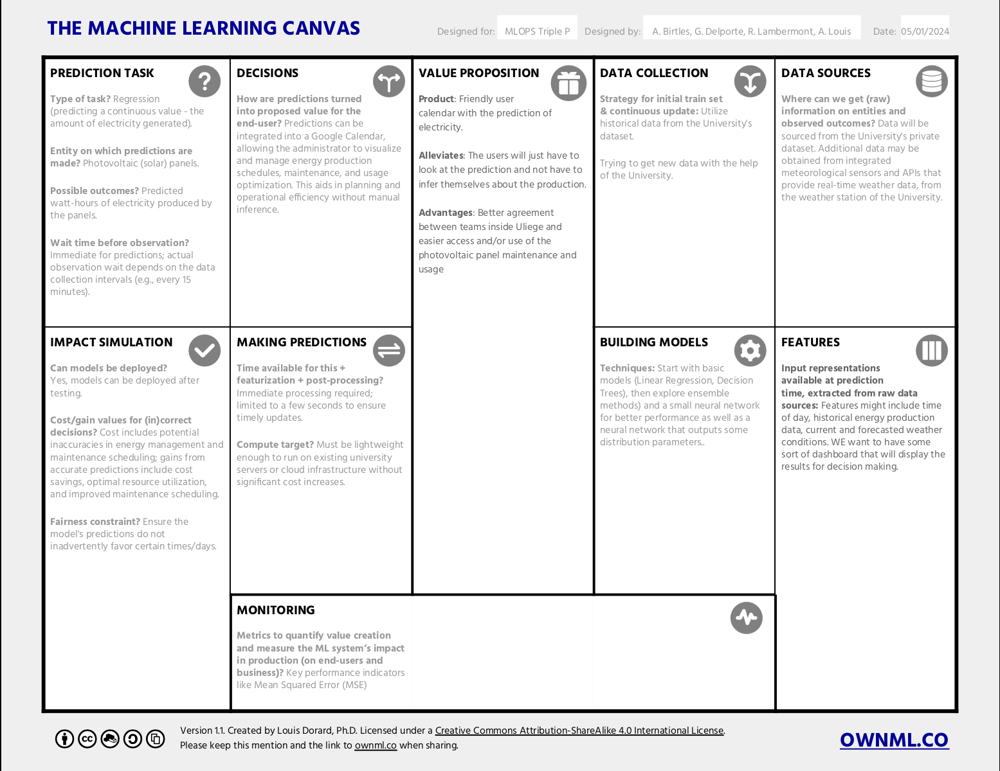
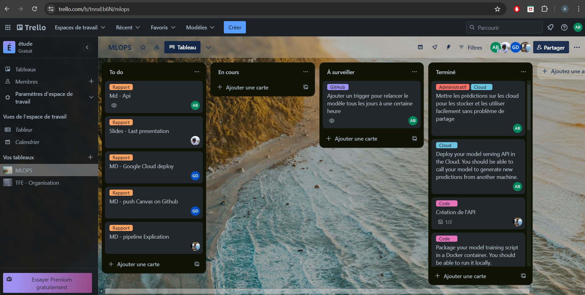

# MLOps-TripleP

## Overview

Welcome to MLOps-TripleP, a Python-based project designed to predict solar panel production over university parking areas. This innovative project leverages machine learning models and real-time weather data to provide accurate forecasts, aiding in the optimization of energy consumption and enhancing sustainability efforts. **The ML pipeline incorporates data processing, model training, prediction, and automated updates via GitHub Actions to ensure the model's accuracy with daily data refreshes.** By contributing to MLOps-TripleP, you're participating in a movement towards more informed decision-making in energy management.


## Features
This project is made for Spring 2024 MLOps Lecture. 

The goal of this project is to learn how to utilize corretly the tools that are typically used in the industry. Every part of the project that we were asked to make is (and will) be compiled in the following table.
| Subject                         | Link                                  |
|---------------------------------|---------------------------------------|
| Exploratory Data Analysis (EDA) | [EDA](data-exploration/EDA.md) |
| API Data | [API data](data/FUTUREDATA.md) |
| ML Pipeline | [ML Pipeline](api/ml_pipeline.md) |


## Repository Tree
```
MLOps-TripleP # Tree of the repository structure
├── data
│
├── data-exploration # EDA Files
│   ├── DataAnalysis.ipynb
│   ├── data_loading.py
│   ├── eda.ipynb
│   └── EDA.md
├── data-modelling # Torch and SKlearn Modelling
│   ├── MODELS.md
│   ├── nn
│   │   ├── nn.ipynb
│   │   └── wandb.png
│   └── sklearn
│       ├── rand_gs_cv.ipynb
│       └── sklearn.ipynb
├── pdf # All of the avaiable handwritten notes
│   ├── canvas.png
│   ├── Machine_Learning_Canvas.pdf
│   ├── Milestone_01_Presentation.pdf
│   ├── ml_canvas.pdf
│   ├── MLOps_Project_Card.pdf
│   ├── PDF.md
│   └── project_description.pdf
└── README.md # You are here

```
## Machine learning canvas
The ML Canvas, adapted from [OWNML](wonml.co), presenting the objectives of our implementation:


## Tools used to collaborate
We used the following tools:

### 1. The repository
This **GitHub** repository for code sharing and feature managment. We use it along with **Gitflow** to manage features, develop, hotfixes...

**Markdown (MD)** files are used within the Git repository to document the project. 

### 2. **Trello with Kanban Boards for Task Management**
Trello, employing the Kanban methodology, is used to manage tasks and visualize the workflow. Each task or piece of work is represented as a card on the Trello board, which moves across lists representing different stages of the project, such as To Do, In Progress, and Done. This visualization aids in monitoring the progress of tasks and ensures that the team prioritizes work effectively.

An example of our board can be seen below:


### 3. **Discord for Communication**
Discord is chosen as the primary communication platform due to its robust features that support both private and team messaging.

We also used discord as it is a more "relaxed" way of communicating, facilitating some easy task other than making some complex GitFlow features.

## Team

- **Birtles Alixia** - alixia.birtles@student.uliege.be
- **Delporte Guillaume** - guillaume.delporte@student.uliege.be
- **Lambermont Romain** - romain.lambermont@student.uliege.be
- **Louis Arthur** - a.louis@student.uliege.be

## Teaching Staff

- **Thomas Vrancken (Instructor)** - t.vrancken@uliege.be
- **Matthias Pirlet (Teaching Assistant)** - Matthias.Pirlet@uliege.be

## Contact

For any inquiries, please reach out to the project team via email or contact the teaching staff directly.

---

Join us in advancing sustainability and optimizing energy consumption through innovative machine learning solutions with MLOps-TripleP!
