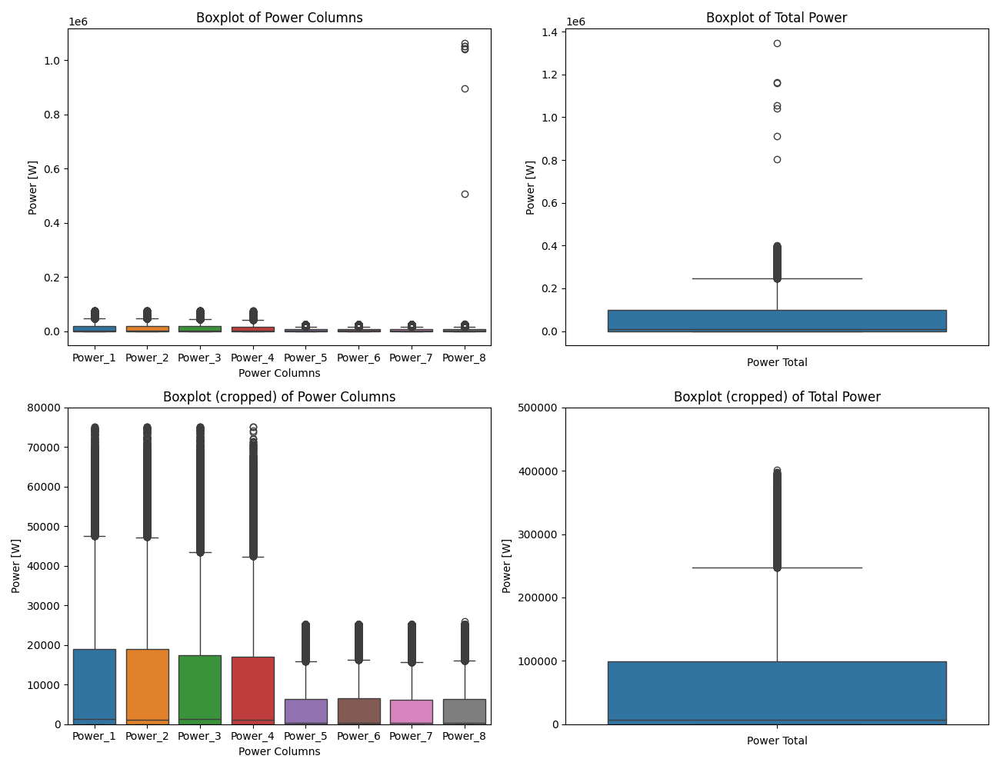

# Exploratory Data Analysis (EDA)

Exploratory Data Analysis (EDA) is a crucial step in understanding the underlying patterns, relationships, and anomalies within datasets. The following analysis is based on solar power generation data, weather conditions, and their interplay over time.

## 1. Overview of the Data

We start by examining the `merged_df` and `cleaned_df` datasets, identifying missing values, and calculating the p/n ratio, which indicates the proportion of samples to features. Despite significant missing values in `merged_df`, the p/n ratio is comfortably high at 3062, ensuring robust statistical analysis.
Some precisions on the matter :

- In the file merged.csv which contains NaN, we observe that there are 4750 rows without correspondence to the forecast files.
- Regarding the forecast files, we see 61343 lines with missing values.
- However, when computing the ratio of samples to features, we find an enormous value of 3062, well above the recommended rule of thumb of 5 for a comprehensive analysis of multivariate data, as discussed in the high-dimensional statistics course.
In attempting to use the complete case scenario, we find that the $p/n$ ratio is still greater than 930, indicating that we should be fine just by ignoring NaN rows.
- Let's shift our focus to the cleaned dataframe. When examining power values, we notice that the panels start producing energy from around 9 AM to 5 PM in the winter, which seems logical, and from 5:30 AM to 10 PM in the summer.

## 2. Data Cleaning and Preparation

The initial focus was on handling missing values, leading to the selection of a complete case analysis. The cleaned dataset (`cleaned_df`) exhibits a healthy p/n ratio (930), suggesting a solid foundation for further analysis.

## 3. Power Generation Analysis

### Raw Data Visualization

The visualization of raw data unveiled anomalies in power generation, particularly with `Power_8` and the `Energy_*` columns as we will see in the following section.

### Boxplots

Boxplots of power generation across different power plants indicated a significant discrepancy in energy production, especially between plants 1-4 and 5-8. Furthermore :

- When looking at the boxplots for the different power column, we get a first view at the erratic functionning of 'Power_8' plant. When looking at google earth sattelite picture, we can see that the Parking B and C are made up of 8 plants made of 160 panels each. A value of more or less 1 Million watts peak would indicate that each panel would produce 6250 Watts, which is impossible, as panels nowadays are not able to produce this much power. We think these are more of a sensor issue.
- When cropping the boxplots to have a better look at them. We can see that Power plants from range 1 to 4 produce much more energy than the one from 5 to 8.

### Evolution Plots

- we can see that some times, the sensor (or computation) malfunctions and a 0 is written in the file
- we can observe that more energy seems to be produced during summer as the steep is greater

## 4. Evolution of Solar Irradiance

- the top solar irradiance values will be in the summer, explicitely at the summur solstice, when the day is the longest. The top solar irradiace curve seems to be smoother and with lower variance.

## 5. Weather Conditions Impact

Investigating weather-related data revealed insights into relative humidity, snowfall, temperature, precipitation, and wind speed, all of which have implications for energy production.
The main takeaways are:

**Relative Humidity (RH2m):**
The relative humidity has a U-shaped trend over the year. The months of January and December observe higher humidity levels, close to 95%, while the mid-year months, specifically June, witness a dip with levels around 65%. Summer is dryer

**Snow:**
Snow accumulation is predominantly observed during the beginning and the end of the year. The months of January and December have noticeable amounts of snow, with almost no accumulation in the months between April and October, showing the snowy season.

**Air Temperature (ST):**
Air temperature follows a bell-shaped curve, indicative of the typical seasonal temperature variations. The warmest months appear to be July and August, with temperatures reaching around 20°C. In contrast, the coldest months are January and December, with temperatures just above 2.5°C. We can see however that the temperature ranges from 10 to 40 degrees in summer and -10 to 10 in the winter.

**Precipitation (PREC):**
Rainfall or precipitation shows that belgium is a pretty rainy contry with some rain accross all seasons altough less in summer.

**Wind Speed (WS10m):**
Wind speed, measured 10 meters above the ground, indicates that the windiest months are March and November, with speeds reaching up to 4.5 m/s. A gradual decrease is observed during the mid-year months, indicating calmer conditions.

## 6. Outlier Detection

Outlier analysis using z-scores and the Mahalanobis distance helped identify and handle anomalous data points, ensuring a cleaner dataset for modeling and the correction of the weird behaviour of Panel 8 and the Energy columns. The other outliers were ignored as attributed to extreme weather conditions.
Here can be seen the z-score for each of the variables:

And after cleaning:

## 7. Descriptive Statistics

Descriptive statistics offered a comprehensive view of each variable, highlighting aspects like kurtosis, skewness, means, and standard deviations, which are crucial for understanding data distribution and central tendencies. Here are the main takeaways :

**CD**:
- Most data points are likely clustered around lower values (mean close to 0), with a long tail of higher values.
- The median being zero suggests that at least half the observations have no cloud cover.

**CM**:
- A large number of zero values, indicating many observations without cloudiness, with few extreme values. (even q3 is low, indicating a very large number of days without middle clouds.)

**CU**:
- A median of zero indicates that over half the data has a low CU value.

**Energy_***:
- The trimmed mean is very close to the actual mean, which could indicate that outliers detection has been succesfully completed.

**PREC**:
- Highly positively skewed with a really sharp peak.
- The median and Q1 are zero, indicating that most of the data points record no or very little precipitation, with a few large outliers.
- The trimmed mean reinforces this as when we remove potential outliers, we lower even more the value of the mean that is already pretty low.

**Power_***:
- Kurtosis and skewness suggest a gaussian distribution.
- The variability seems to be pretty high, as can be seen in regards to their standard deviation.

**RH2m**:
- The distribution is relatively symmetrical around the mean, with most values close to 77.53%.

**SNOW**:
- Extremely positively skewed with a really sharp peak (almost always equal to 0 except for rare occurences).
- Most observations have no snowfall, with rare instances of heavy snowfall. This can be seen by the trimmed mean equal to 0 after the removal of the 5% highs and that the max value is arround 72mm.

## 8. Correlations

Correlation analysis between different variables unearthed significant relationships, particularly between solar irradiance, temperature, and power production.
After analysis, we settled on using Power_Total and Energy_total to show the overall behaviour of the data as they were linearly dependant on other Power_[1-8] and Energy_[1-8].

Here are the interesting (anti-)correlations:

**Strong Positive Correlations**:

- SWD - SWDTop: This correlation is expected as both represent solar irradiance measurements, with SWD being at the ground level and SWDtop being at the top of the atmosphere. The values should track together as they are both affected by the solar elevation angle and day length.

- ST - TT2m: Surface temperature (ST) and temperature at 2 meters above the ground (TT2M) are closely related because they both reflect the heating effects of the sun on the Earth's surface and near-surface air.

- ws10m - ws100m: Wind speed at 10 meters is expected to be correlated with wind speed at 100 meters, even though it's usually expected to be lower closer to the ground.

- SWD(Top) - Power_Total: A high solar irradiance leads to increased solar power generation (as said in the explaination of the datasets that the teacher gave). Therefore, the total solar irradiance at the top of the atmosphere (or the SWD on the ground) is a determining factor for the potential solar power generation measured by Power_Total.

**Strong Negative Correlations**:

- ST/TT2m - RH2m: Temperature and relative humidity are often inversely related due to the nature of air to hold moisture. As the temperature increases, the air can hold more water vapor, which can lower relative humidity if additional moisture is not added to the air.

**Moderate Positive Correlations**:

- SWD/SWDTop - TT/TT2m: Higher solar irradiance leads to increased temperatures, both at the surface (ST) and at 2 meters above ground (TT2M).

- CD - RH2m: Low clouds are often associated with higher humidity levels as they form in conditions where the air is moist and there's not much temperature difference between the ground and the atmosphere.

- CM - PREC: Medium-level clouds can be associated with precipitation, as they maybe indicate the presence of clouds that can lead to rain or snow.

- CU - CM: High clouds and medium clouds can be positively correlated because they (maybe) can be part of the same weather system.

**Moderate Negative Correlations**:

- CD - ST/TT2m: Low clouds can block sunlight, leading to lower temperatures at the Earth's surface and at 2 meters above the ground.

- RH2m - Power_Total: Higher humidity can be associated with cloud coverage and precipitation, which would reduce the efficiency of solar power generation, thereby lowering the Power_Total. Or maybe solar panels are less efficient when moist

- CD - SWD: The presence of low clouds can reduce the amount of solar radiation reaching the ground, hence the negative correlation with SWD.

Here is the correlation matrix: 

## 9. Daily Production Analysis

Daily analysis demonstrated a strong correlation between solar irradiance and energy production, emphasizing the influence of sunlight on power generation and the usefulness of this data to predict the power produced by the pannels.

With the plot and the correlation between the two variable in mind, we can see that the daily production is highly correlated with the energy produced that day. The two distribution look alike (When normalized) and it looks like one could be used to try and predict the other.

1. `solar_irradiance_max`: The maximum solar irradiance (`SWD`) is calculated for each day using the `max()` function after resampling the original time series data to daily frequency (`'D'`).

2. `solar_irradiance_mean`: The mean solar irradiance (`SWD`) is calculated for each day using the `mean()` function on the daily resampled data.

3. `daily_production`: The daily energy production is then calculated as the difference between the daily maximum and minimum, providing the net energy produced each day.

4. A scatter plot is created to visualize the normalized daily energy production and solar irradiance data. The data points for energy production (`Energy_Total`) and solar irradiance (`SWDmax` and `SWDmean`) are plotted as scatter points, with normalization achieved by dividing by the standard deviation (`std(ddof=1)`). This normalization allows for a comparison on the same scale, otherwise it would be impossible to compare the datapoints given the difference in scale between the two columns.

5. Vertical lines are added to the plot to indicate seasonal changes on specific dates (`season_changes`).

6. The correlation coefficients between daily energy production and the maximum/mean solar irradiance are calculated and printed for analysis afterwards. 

## 11. Monthly Variations

Monthly analysis highlighted the seasonal impact on power production, with significant differences in energy generation patterns across different months:

**Shape of the Distribution Across Months:**

- **Consistency**: Monthly distributions follow the expected Gaussian pattern of solar energy production, peaking around midday and decreasing towards sunrise and sunset.
- **Seasonal Variation** : Median power production varies monthly, reflecting seasonal changes in sun elevation. Summer months (June, July, August) exhibit higher peaks due to longer daylight hours and higher sun angles, compared to winter months (December, January, February).
- **Sunrise and Sunset**: The timings of daily power production onset and end slightly shift across the months, indicating changes in sunrise and sunset times throughout the year.

**Spread Across Months:**

- **Consistency at Night**: Minimal data spread during night and early morning hours (0 to 6 am) and late evening hours after sunset suggests little to no solar power production during these times throughout the year.
- **Variability at Midday**: High variability in midday power production, reflected in error bars, suggests potential weather influences causing fluctuations, observed notably in months like April and May.

