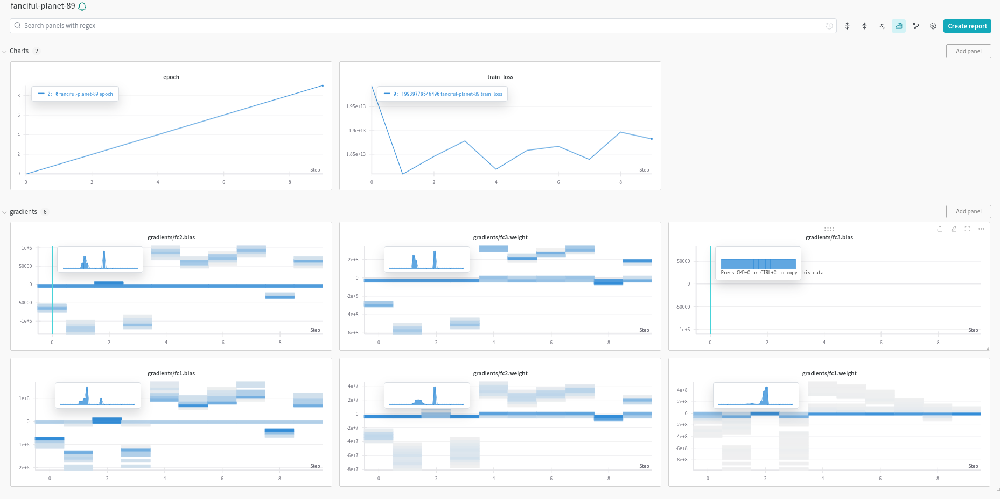

# Exploring Machine Learning Models

Our objective is to forecast electricity production, generated by solar panels. 
To achieve this, we have undertaken a comprehensive exploration of various simple machine learning models. 
In the sections that follow, we will detail the performance and strengths of each model tested. 
By delving into the intricacies of these machine learning approaches, we aim to establish a robust foundation 
for predicting solar electricity output in the context of our project.

We opted for Mean Squared Error (MSE) as our evaluation metric due to its suitability for regression tasks.
MSE measures the average squared difference between predicted and actual values, providing a comprehensive assessment of model performance by emphasizing accurate predictions 
while penalizing larger errors. This choice aligns with our goal of developing a solar electricity production prediction model that minimizes overall prediction errors

## 1. Scikit-Learn
By leveraging scikit-learn's capabilities, we delve into the realm of machine learning models 
to anticipate solar power generation. 

We have partitioned our dataset into training, testing, and validation sets with a distribution of 75% for training, 12.5% for testing, and the remaining 12.5% for validation. 

In the case of the Scikit-Learn, we have tested the folowing models:
- Linear Regression
- k-Nearest Neighbors
- Decision Trees
- Random Forests
- Gradient Boosting
- Support vector machines (SVMs)

Among all of these, the wort models are the SVMs and the Linear regression. While the best one seams to be the Random Forests. The current performance of the models for each of the solar panels is reported in the following table:

| Solar Panel | Power 1 | Power 2 | Power 3 | Power 4 | Power 5 | Power 6 | Power 7 | Power 8 |
|-------------|---------|---------|---------|---------|---------|---------|---------|---------|
| Model       | RF      | RF      | RF      | RF      | RF      | RF      | RF      | RF      |
| MSE         | $3.78\times10^7$ | $3.78\times10^7$ | $3.63\times10^7$ | $3.27\times10^7$ | $5.40\times10^6$ | $5.46\times10^6$ | $5.57\times10^6$ | $5.47\times10^6$ |


## 2. Neural Network

First, we assess the performance of a concise PyTorch neural network model in predicting solar electricity production.
The model incorporates Rectified Linear Unit (ReLU) activation functions between layers to introduce non-linearities. 
Designed for regression tasks, it consists of three fully connected layers. During training, we employ the Adam optimizer, 
and the neural network undergoes 15 epochs to iteratively learn and refine its weights.


In our second approach, we construct a PyTorch neural network tailored for predicting photovoltaic power generation, employing a structure that adheres to a normal distribution.
The model comprises three fully connected layers, incorporating Rectified Linear Unit (ReLU) activation functions for essential non-linearities. 
The output layer features two neurons, representing the mean (mu) and log variance (logvar) parameters of a normal distribution. Training involves the use of the Adam optimizer over 15 epochs.


The second neural network exhibits a loss oscillating between 1.8 and 2, while the first network generally fluctuates between 1.8 and 1.9, with one notable exception.

Moreover, we leveraged the use of [Weight and Biases](https://wandb.ai/) to track the loss easily and automatically, as well as plotting the loss at running time, making the debugging of the net easier.

In order to do that, we followed thoses steps :

- First, we have to initialize the run and specify the project in which the run will be stored as well as the user account which wandb has to use.
```python
wandb.init(project="mlopstriplep", entity="g-delporte")
```

- Then, we have to configure the run hyperparameters as well as telling wandb to watch the gradients of the net and the loss functiion, to be able to see for any vanishing gradient.
```python
wandb.config = { # Setting models hyperparams
"learning_rate": lr,
"epochs": nb_epoch,
"batch_size": 4,
}

wandb.watch(net, criterion, log="all", log_freq=10) # Launching gradients watchdog

```

- Then, we have to log, at each epoch, the loss for this epoch, so wandb can update the loss graph automatically for us. We can do this using the log command of wandb
```python
    wandb.log({ # Logging the current params
        "epoch": epoch,
        "train_loss": losses[-1], # last loss avaiable
    })
```
- Last but not least, we need to finish the run when we are done.
```python
    wandb.finish() # Close the ongoing run
```
This is what it looks like during the run:

We can see the gradients as well as the loss plotting just right in front of our eyes.


## 3. Randomized Search to Optimize Hyperparameters of the Random Forest Model

We have employed a randomized search to optimize the hyperparameters of the Random Forest model.
Here are the results of the search:

| Parameter          | Value |
|--------------------|-------|
| n_estimators       | 242   |
| max_features       | 'log2'|
| max_depth          | 74    |
| min_samples_split  | 6     |
| min_samples_leaf   | 1     |
| bootstrap          | False |
